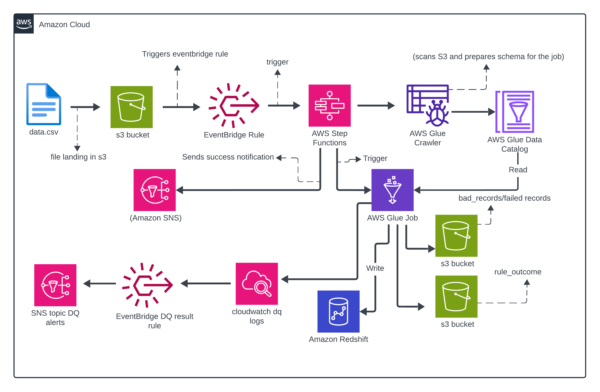
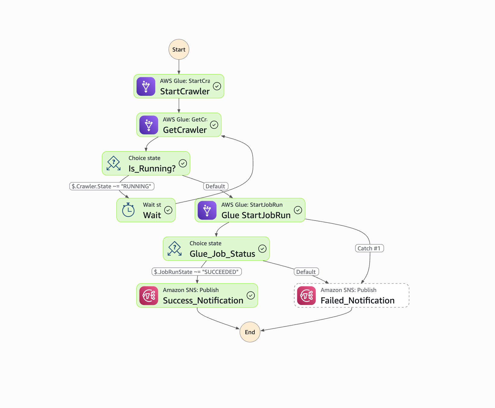
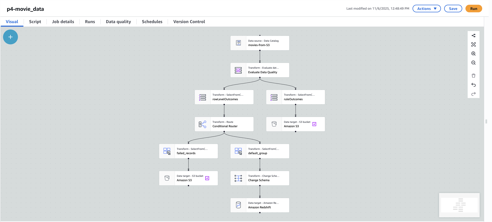
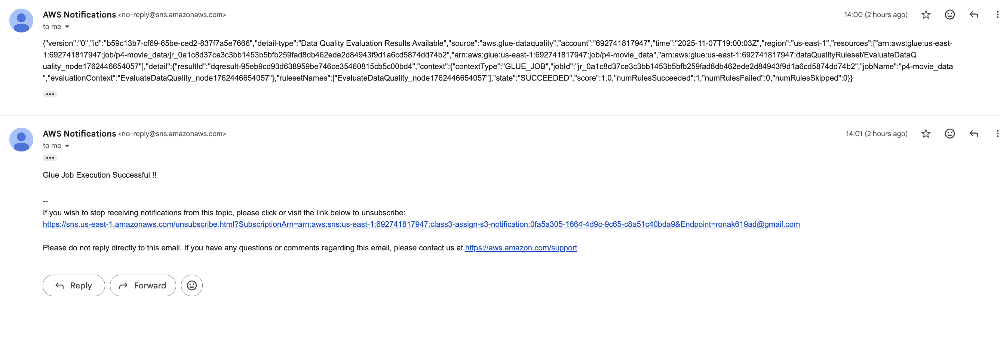

# 🎬 Quality Movie Data Pipeline on AWS (Glue + Redshift + Step functions + Data Quality)

This project shows how to build an **event-driven, data quality–aware pipeline** for movie ratings using AWS:

- Upload an **IMDB-style movie ratings CSV** to S3
- Automatically trigger a pipeline using **EventBridge + Step Functions**
- Run **AWS Glue Data Quality** checks and quarantine bad records
- Load clean data into **Amazon Redshift**
- Use a **materialized view** for fast analytics
- Get **email alerts** via **SNS** when data quality evaluations complete


---

## 🧱 High-Level Architecture



### Step Functions – State Machine Graph

**Definition view (no run):**


**Successful execution:**



---

### Glue Job – Visual Graph



---

### SNS – Email Alerts



**Flow (left → right):**

1. **S3 (`input_data/`)**

   - Raw `imdb_movie_ratings.csv` is uploaded to an S3 bucket (e.g. `movies-gds`).

2. **EventBridge (S3 Rule)**

   - Listens for `ObjectCreated` events on `input_data/*.csv`.
   - Triggers a **Step Functions** state machine when a new file arrives.

3. **AWS Step Functions**  
   Orchestrates the pipeline:

   - Starts a **Glue Crawler (S3)** → updates a Glue Catalog table for the raw CSV.
   - (Optionally) runs a **Glue Crawler (Redshift)** → keeps the warehouse table in the catalog.
   - Runs the **Glue ETL + Data Quality Job**.
   - Sends **pipeline status notifications** to SNS (success/failure).

4. **AWS Glue Crawlers & Data Catalog**

   - Crawler 1: scans **S3 `input_data/`** → creates/updates a Glue table (e.g. `movies_raw_input`).
   - Crawler 2: scans **Redshift** table `movies.imdb_movies_rating` → registers it in the catalog.

5. **AWS Glue Job (ETL + Data Quality)**

   - Reads from Glue Catalog table `movies_raw_input`.
   - Runs **Evaluate Data Quality** rules (rating ranges, non-null checks, valid year, etc.).
   - Splits data into:
     - ✅ **Good records** → Redshift `movies.imdb_movies_rating`
     - ❌ **Bad records** → S3 `bad_records/`
     - 📊 **Rule outcomes** → S3 `rule_outcome_from_etl/`
   - Publishes **DQ evaluation results** into **CloudWatch Logs**.

6. **Amazon Redshift + Materialized View**

   - Base table: `movies.imdb_movies_rating` (only quality-checked rows).
   - Materialized view: `movies.year_aggregated_genre`
     - Pre-aggregated **movie counts by `released_year` and `genre`**
     - Great for analytics and dashboards.

7. **Monitoring & Alerts (CloudWatch, EventBridge DQ Rule, SNS)**
   - Glue DQ → CloudWatch Logs → **EventBridge DQ Rule** → **SNS DQ Topic** → Email.
   - Separate SNS topic used by Step Functions for overall **pipeline status** notifications.

---

## 🧩 AWS Services Used

- **Amazon S3** – Data lake storage for:
  - `input_data/` – incoming CSV files
  - `bad_records/` – failed DQ records
  - `rule_outcome_from_etl/` – rule evaluation outputs
- **AWS Glue**
  - **Crawlers** – infer schema from S3 and Redshift
  - **Data Catalog** – central metadata store
  - **Glue Job** – ETL + Data Quality
- **AWS Glue Data Quality** – rules & evaluation for row-level and rule-level checks
- **AWS Step Functions** – orchestration of crawlers + Glue job + SNS
- **Amazon EventBridge**
  - Rule 1: **S3 event → Step Functions**
  - Rule 2: **Glue DQ results → SNS (DQ alerts)**
- **Amazon Redshift** – warehouse for curated movie data
- **Materialized View** – fast aggregated analytics (movies by year + genre)
- **Amazon CloudWatch Logs** – stores DQ evaluation results
- **Amazon SNS** – email notifications for:
  - Pipeline status (from Step Functions)
  - Data quality results (from EventBridge DQ rule)

---

## 🧪 Data Quality & Materialized View – Why It Matters

The goal isn’t just to move rows; it’s to **trust** the data we move.

### Data Quality Rules (examples)

Some of the rules implemented via **Glue Data Quality**:

- `IMDB_Rating` is **not null** and is between **0 and 10**
- `Released_Year` is a valid year (not random text)
- `Series_Title` is not empty
- `Genre` is not empty

Bad rows are **quarantined** to S3 (`bad_records/`), while good rows go to Redshift.

### Why a Materialized View?

In real-world analytics:

- Teams often query things like:
  - **Revenue by region**
  - **Orders per day**
  - **Active users by country**
- These aggregations are used **constantly** (dashboards, reports, product analytics).

If every query re-scans millions of rows, you burn **compute** and add latency.

- A **normal view** is just a saved SQL query → recomputes every time.
- A **materialized view**:
  - Stores the **pre-aggregated** result.
  - Trades a bit of **storage** and periodic **refresh** for:
    - Faster dashboards
    - Lower compute cost on repeated queries

In this project, the materialized view:

```sql
CREATE MATERIALIZED VIEW IF NOT EXISTS movies.year_aggregated_genre AS
SELECT
  released_year,
  genre,
  COUNT(*) AS movie_count
FROM movies.imdb_movies_rating
GROUP BY released_year, genre;

```

…is a simple example, but the pattern is the same as a production use case:  
any **high-traffic, read-heavy aggregation** that can tolerate batched refreshes.

---

## 🚦 End-to-End Flow

1. Upload `imdb_movie_ratings.csv` → `s3://movies-gds/input_data/`.

2. S3 event → EventBridge rule → Step Functions state machine.

3. Step Functions:

   - Runs S3 Glue Crawler → updates `movies_raw_input` table.
   - (Optionally) runs Redshift crawler → refreshes catalog metadata for DWH table.
   - Runs Glue Job:
     - Evaluate Data Quality
     - Write bad rows to S3 (`bad_records/`)
     - Write DQ results to S3 (`rule_outcome_from_etl/`)
     - Load good records into Redshift.
   - Sends **pipeline status** to SNS.

4. Glue Data Quality → CloudWatch Logs.

5. EventBridge DQ rule (`p4-movies-data-quality`) → SNS DQ topic → email alert.

6. In Redshift:
   - Refresh materialized view:
     ```sql
     REFRESH MATERIALIZED VIEW movies.year_aggregated_genre;
     ```
   - Query aggregated results:
     ```sql
     SELECT
       released_year,
       genre,
       movie_count
     FROM movies.year_aggregated_genre
     ORDER BY released_year, genre
     LIMIT 20;
     ```

---

## 🧭 Cost & VPC Notes

In a **production setup**, you’ll often run Glue and Redshift inside a **VPC** and connect via **VPC endpoints** (S3, EventBridge, SNS, etc.) to keep traffic inside AWS.

That’s good for security, but:

- Interface endpoints are billed **per hour + per GB**.
- Always-on clusters + endpoints can quietly add up.

If you’re just experimenting:

- Prefer **small dev-sized clusters / serverless options**
- Clean up:
  - Endpoints
  - Clusters
  - Unused resources  
    when you’re done.

Be mindful of what you leave running.
